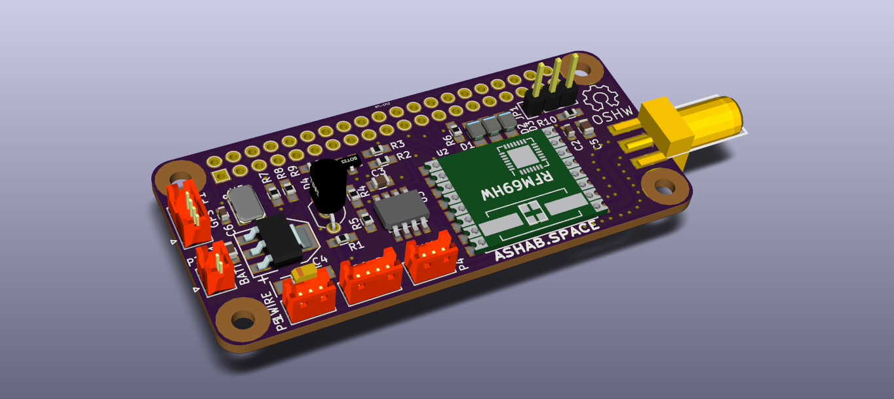

# StratoZero

StratoZero is a Raspberry Pi Zero hat for use in High Altitude Balloon missions.
It uses a RFM95 LoRa radio module, ds18b20 temperature sensors, a mcp3002 SPI ADC to monitor the battery, a MS5607 barometer, and several connectors for GPS, i2c, analog inputs, and more.

Check BOM File for components.

This board is designed to be used with the ASHAB-RS flight software: https://github.com/ladecadence/ASHAB-RS

## Component changes

 * Initial tests with the original voltage regulator showed brownouts, so now I'm using an MIC39100-5 and it works perfect (same footprint).
 * DS3231 and it's battery come from the small and cheap RTC modules you can find on ebay or aliexpress.

http://ashab.space

